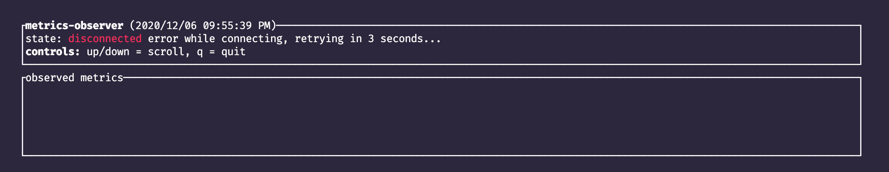
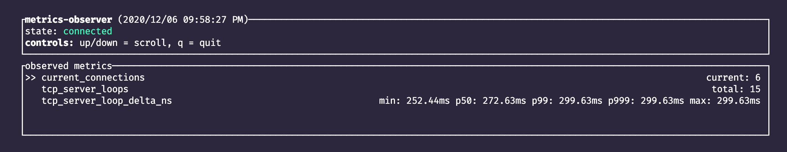
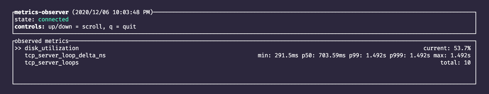

# metrics-observer

A text-based UI for observing metrics exported by [`metrics-exporter-tcp`](../metrics-exporter-tcp).

## quick start

    # Install it:
    cargo install metrics-observer

    # Connect to an application using the defaults of metrics-exporter-tcp
    # which is 127.0.0.1:5000:
    metrics-observer

    # Specify a custom address to connect to:
    metrics-observer 192.168.1.1:5000

## understanding the output

### status bar
The status bar at the top will track the connection status, as well as list as the possible
controls that can be used.  Here's a shot where the observer is disconnected from the target process
and is waiting to retry its connection:

### basic data display
As metrics are emitted by the process, they'll be shipped to the observer and displayed.  As
[`metrics-exporter-tcp`] doesn't store any metrics itself, when reconnecting, all of the previous
values will be gone, and the observer will start collecting from scratch.

For counters, you'll see values in the form of `total: <value>`, where `<value>` is the counter
total since we connected to the endpoint.  For gauges, instead of `total:`, you'll see `current:` as
the prefix.  For histograms, a pre-defined set of percentiles will be calculated: minimum, p50, p99,
p999, and
maximum.

Labels are shown in square brackets after the metric name.  In this example, you can see a metrics
where the `system` label is set to the value `foo`.

Here's a simple example:

### unit support
If a given metric has its [units](https://docs.rs/metrics/*/metrics/enum.Unit.html) defined, then
`metrics-observer` will display them accordingly.  We use the [canonical label
value](https://docs.rs/metrics/*/metrics/enum.Unit.html#method.as_canonical_label) for the given
unit, which is based on the official abbreviation for a unit or the most commonplace label.  For
example, a data rate-based unit such as _terabits per second_ will show as `Tbps` while a data-based
unit such as _mebibytes_ will show as `MiB`.  However, in the case of the _count per second_ unit,
which is not an official unit, we use the commonplace label of `/s`.

Beyond the way that metrics with units will be labeled, we also specifically scale time-based units
in a more human-friendly way. For example, if a value is defined as being nanoseconds, but the value
itself is actually representative of 1.5 milliseconds, we would display it as `1.5ms` instead of the
full value in nanoseconds only.  This also applies for histograms using time-based units, where each percentile will be displayed in the most appropriate timebase.

Here's an example where some metrics have a unit, and we have a histogram where percentiles have
values across different timebases:

